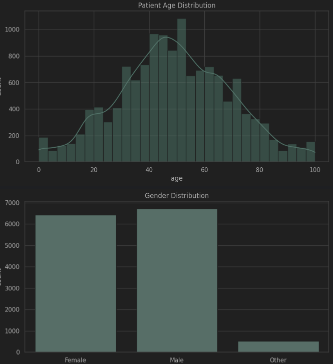
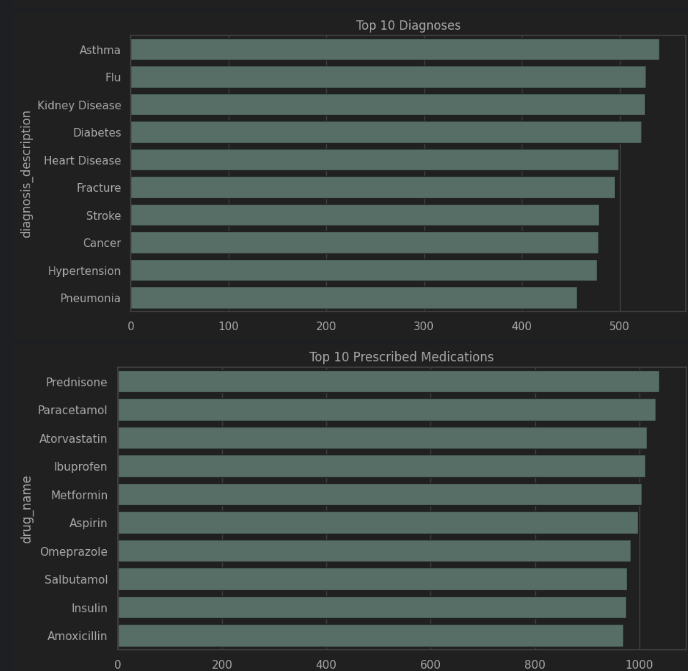

# HealthCare-Analytics
# 🩺 Healthcare Analytics EDA Project

## 📘 Overview
This project explores a **synthetic healthcare dataset** designed to simulate real-world challenges, including missing values, outliers, and inconsistent data across multiple tables. It demonstrates how **data cleaning** and **exploratory analysis** can uncover actionable insights in the healthcare domain.

---

## 🎯 Problem Statement
Healthcare organizations collect vast amounts of patient, clinical, and billing data, but understanding patterns and trends is challenging.  
The goal is to **clean, merge, and analyze** multi-table healthcare data to reveal insights on:

- Patient demographics  
- Clinical outcomes  
- Facility performance  
- Billing trends  

---

## 🩹 Dataset
The dataset contains **8 relational tables**:

1. **Patients**  
2. **Facilities**  
3. **Encounters**  
4. **Diagnoses**  
5. **Lab Results**  
6. **Medication Orders**  
7. **Providers**  
8. **Billing**

Each table includes realistic values with messy data (missing, duplicate, or inconsistent entries) to enable thorough EDA and data cleaning practice.

---

## 🔍 Key Outputs & Insights
- Patient **age, gender, and ethnicity distributions**  
- **Facility types**, quality ratings, and regional analysis  
- Most common **diagnoses** and **medications**  
- **Lab result abnormality** trends and provider specialties  
- **Total charges distribution**, payment status, and high-cost encounters  
- Identification of **top-performing facilities** and **high-utilizer patients**

---

## 🧰 Tech Stack & Libraries
- **Python:** Data manipulation, cleaning, and analysis  
- **Pandas & NumPy:** Dataframes and numerical operations  
- **Matplotlib & Seaborn:** Data visualization and plotting  
- **Jupyter Notebook:** Interactive EDA and analysis workflow  

---

## 💡 Impact
This project provides analytical insights that help:
- **Hospital administrators** optimize facility performance and costs  
- **Clinicians** identify treatment and diagnostic trends  
- **Policymakers** allocate healthcare resources more efficiently  

---

## 📊 Outcomes
By addressing real-world data issues and applying robust EDA techniques, this project demonstrates practical **data cleaning, analysis, and visualization skills** in the healthcare domain.

<table>
<tr>
<td></td>
<td></td>
</tr>
</table>

